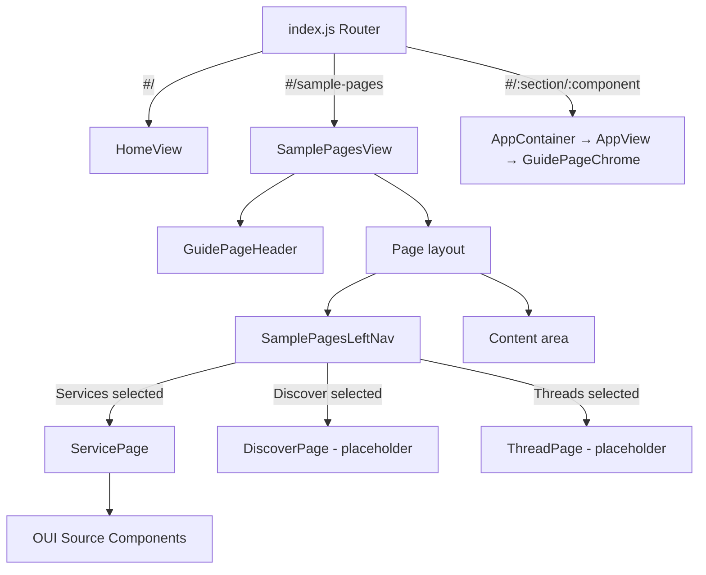

# Design Document: Sample Pages

## Overview

This feature adds a "Sample Pages" showcase to the OUI documentation site. A new button in the `GuidePageHeader` navigates to a dedicated route (`#/sample-pages`) that renders a custom left navigation panel (matching the Figma design) alongside sample page content. Only the Service page is fully implemented; Discover and Threads appear in the nav but render placeholder content. Because all components are imported from source, changes are reflected instantly via webpack HMR.

### Key Design Decisions

1. **Dedicated route outside the normal navigation flow**: The `sample-pages` route is registered directly in `src-docs/src/index.js` alongside the home route, not through `routes.js`. This avoids it appearing in the standard component sidebar and allows it to bypass `AppView`/`GuidePageChrome` entirely.

2. **Custom left nav matching Figma design**: Instead of using `OuiSideNav` directly, the left nav is a custom component that matches the Figma design (node `9917:47781`). It includes a header with logo, a search bar, nav items, and a footer with icon buttons and avatar — all built with OUI components.

3. **State-driven page switching**: A simple React `useState` hook tracks the active sample page. No sub-routes are needed — the left nav just swaps which component renders in the content area.

4. **Placeholder pages for Discover and Threads**: These pages are listed in the nav for future expansion but render `OuiEmptyPrompt` placeholders instead of full layouts.

## Figma Design Reference

**File:** `figma.com/design/V2RvjK3B8xtOHfXHRL2xaF`
**Node:** `9917:47781` ("LEFT NAV with WS")

### Left Nav Design Specifications

The left nav is a 270px-wide sidebar with the following structure:

```
┌─────────────────────────┐
│  [Logo/Mark] [≡ menu]   │  ← Header (logo + collapse button)
│─────────────────────────│
│  🔍 Search the menu     │  ← Compressed search field
│─────────────────────────│
│  Services               │  ← Nav items (active has light bg
│  Discover               │    with 8px rounded corners)
│  Threads                │
│                         │
│                         │
│─────────────────────────│
│  🏠 📁 ⚙️ 💻 ℹ️  [OS]   │  ← Footer (icon buttons + avatar)
└─────────────────────────┘
```

**Visual specs from Figma:**
- Container: white background, right border (`ouiBorderColor`), rounded top-right/bottom-right corners (24px)
- Header: OpenSearch logo mark (32x32), menu/collapse icon button (16px), separated from content by bottom border
- Search bar: compressed `OuiFieldSearch`, placeholder "Search the menu", full width within 238px content area
- Nav items: Rubik font, 14px, `ouiTextSubduedColor` (#6a717d), 8px horizontal padding, 10px vertical padding
- Active item: light background (`ouiColorLightestShade` / #f5f7fa), 8px border-radius
- Footer: horizontal rule divider, row of 24px icon buttons (home, workspaceSelector, gear, console, info) + 24px avatar with initials, 16px padding

## Architecture



### Routing Integration

The `sample-pages` route is added as a top-level route in `src-docs/src/index.js`, rendered before the `AppContainer` catch-all routes. This route renders `SamplePagesView` directly (wrapped in `ThemeContext` and `LinkWrapper`), without going through `AppContainer`/`AppView`, so the `GuidePageChrome` sidebar is never rendered.

## Components and Interfaces

### New Files

| File | Purpose |
|------|---------|
| `src-docs/src/views/sample_pages/sample_pages_view.js` | Top-level view with left nav and page switching |
| `src-docs/src/views/sample_pages/sample_pages_left_nav.js` | Custom left nav component matching Figma design |
| `src-docs/src/views/sample_pages/service_page.js` | Service sample page component (fully implemented) |
| `src-docs/src/views/sample_pages/discover_page.js` | Discover placeholder page |
| `src-docs/src/views/sample_pages/thread_page.js` | Thread placeholder page |

### Modified Files

| File | Change |
|------|--------|
| `src-docs/src/components/guide_page/guide_page_header.tsx` | Add "Sample Pages" button to right-side items (desktop + mobile popover) |
| `src-docs/src/index.js` | Add `#/sample-pages` route before the `AppContainer` routes |

### Component Interfaces

#### SamplePagesView

```jsx
const SamplePagesView = () => {
  const [activePage, setActivePage] = useState('service');
  // Renders: GuidePageHeader, flex layout with SamplePagesLeftNav + content area
};
```

State:
- `activePage`: `'service' | 'discover' | 'thread'` — defaults to `'service'`

#### SamplePagesLeftNav

```jsx
const SamplePagesLeftNav = ({ activePage, onPageChange }) => {
  // Props:
  //   activePage: string - currently selected page key
  //   onPageChange: (pageKey: string) => void - callback when nav item clicked
  //
  // Renders the Figma-designed left nav:
  //   - Header with OpenSearch logo mark + collapse icon
  //   - OuiFieldSearch (compressed) with "Search the menu" placeholder
  //   - Nav items: Services, Discover, Threads (active item highlighted)
  //   - Footer with OuiHorizontalRule + icon buttons (home, workspaceSelector, gear, console, info) + OuiAvatar
};
```

#### ServicePage

```jsx
// Stateless functional component, no props
// Mimics OpenSearch Observability APM Services view (Figma node 9917:47775)
// Light gray page background (ouiPageBackgroundColor / #f0f2f4)
// Includes: breadcrumbs, page header "Services", search/filter bar, services data table
const ServicePage = () => {
  // OuiBreadcrumbs, OuiPageHeader, OuiFieldSearch, OuiFilterGroup,
  // OuiBasicTable with columns: Name, Average Latency, Error Rate, Throughput
  // Hardcoded mock data for 5+ service entries
};
```

#### DiscoverPage / ThreadPage

```jsx
// Stateless functional components, no props
// Render OuiEmptyPrompt with "Coming soon" message
const DiscoverPage = () => { /* OuiEmptyPrompt placeholder */ };
const ThreadPage = () => { /* OuiEmptyPrompt placeholder */ };
```

### GuidePageHeader Changes

Add a "Sample Pages" button/link to the `rightSideItems` array:
- Desktop: render as an `OuiHeaderSectionItemButton` with a tooltip, similar to the GitHub/Figma buttons
- Mobile: render as an `OuiButtonEmpty` inside the existing mobile popover menu

### index.js Route Addition

Add a new `<Route>` for path `/sample-pages` that renders `SamplePagesView` wrapped in `LinkWrapper` and `ThemeProvider` context. This route must appear before the dynamic `routes.map(...)` block so it takes precedence.

## Data Models

No persistent data models are needed. The only state is the `activePage` string held in `SamplePagesView`'s local React state.

| State | Type | Default | Location |
|-------|------|---------|----------|
| `activePage` | `'service' \| 'discover' \| 'thread'` | `'service'` | `SamplePagesView` useState |

The Service page uses hardcoded mock data (table rows, stats). Discover and Thread pages are placeholders with no data.

## Correctness Properties

### Property 1: Nav item click renders correct page and marks it selected

*For any* navigation item in the Left_Nav (Services, Discover, Threads), clicking that item should cause the corresponding page content to render in the main content area AND that nav item should be visually marked as active.

**Validates: Requirements 3.5, 3.6**

### Property 2: Service page renders without error under all themes

*For any* registered Doc_Site theme (light, dark, next-light, next-dark, v9-light, v9-dark), rendering the Service page within the theme context should complete without throwing an error.

**Validates: Requirements 4.3, 8.1, 8.3**

## Error Handling

| Scenario | Handling |
|----------|----------|
| Unknown `activePage` value | `SamplePagesView` defaults to rendering `ServicePage` for any unrecognized value |
| Component render error in a sample page | Wrap each page in `OuiErrorBoundary` to catch and display errors gracefully |
| Navigation to `#/sample-pages` with invalid hash fragment | The route matches on the path prefix; fragments are ignored |

## Testing Strategy

### Unit Tests

1. **Header button presence**: Render `GuidePageHeader` and assert a "Sample Pages" button/link exists.
2. **Header button navigation**: Verify the button links to `#/sample-pages`.
3. **Left nav items**: Render `SamplePagesLeftNav` and assert three nav items: "Services", "Discover", "Threads".
4. **Default selection**: Render `SamplePagesView` and assert "Services" is initially active.
5. **Service page components**: Render `ServicePage` and assert key OUI components are present.
6. **Placeholder pages**: Render `DiscoverPage` and `ThreadPage` and assert `OuiEmptyPrompt` is present.

### Property-Based Tests

**Test 1**: Nav item click renders correct page and marks it selected
- Generator: randomly pick one of `['service', 'discover', 'thread']`
- Assert: correct page renders AND nav item is visually active

**Test 2**: Service page renders without error under all themes
- Generator: randomly pick a theme from all registered themes
- Assert: no error thrown during render
